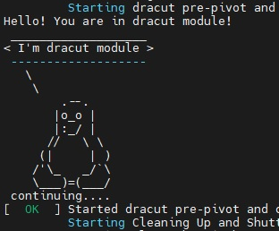

# Otus Homework 7. Grub

### Домашнее задание
Работа с загрузчиком

**Цель:**  
Научиться попадать в систему без пароля.  
Устанавливать систему с LVM и переименовывать в VG.  
Добавлять модуль в initrd.  

**Задание**
- Попасть в систему без пароля несколькими способами.
- Установить систему с LVM, после чего переименовать VG.
- Добавить модуль в initrd.


## Выполнение
Домашнее задание выполнялось для ВМ с ОС **Centos 7**. Бокс был загружен из Vagrant Cloud, соотвественно, выполнение команды **vagrant up** должно осуществляться при ***подключенном VPN-соединении***.

### Попасть в систему без пароля несколькими способами

Выполнить данное задание возможно из GUI интерфейса Virtual Box, изменив параметры загрузки grub, нажав *e*
- **Способ 1**
  
В конце строки, начинающейся с linux16, добавляем `init=/bin/sh` и нажимаем `Ctrl+x`.  
В этом случае файловая система будет находиться в режиме для чтения. Чобы это исправить, вводим команду `mount -o remount,rw /`
- **Способ 2**
  
В конце строки, начинающейся с linux16, добавляем `rd.break` и нажимаем `Ctrl+x`.  
Попадаем в *emergency mode*. Аналогично файловая система смонтирована в режиме для чтения. Исправим это и попробуем изменить пароль пользователя *root*.
```
mount -o remount,rw /sysroot
chroot /sysroot
passwd root
touch /.autorelabel
```
- **Способ 3**
    
В конце строки, начинающейся с linux16, добавляем `rw init=/sysroot/bin/sh` и нажимаем `Ctrl+x`.
В этом случае файловая система уже смонтирована в режиме на запись.
### Установить систему с LVM, после чего переименовать VG

Задание выполняется с помощью *bash* скриптов , добавленных в *Vagrantfile*.
После пересоздания образа **initramfs** ВМ перезагружется с помощью [плагина vagrant-reload](https://github.com/aidanns/vagrant-reload)  
```
vagrant plugin install vagrant-reload
```
В результате работы скриптов в каталоге /home/vagrant/ появится файл vg.txt, в котором отражены старое и новое имя Volume Group, а также результат команды lsblk.

```
NAME                    MAJ:MIN RM  SIZE RO TYPE MOUNTPOINT
sda                       8:0    0  128G  0 disk
├─sda1                    8:1    0    1G  0 part /boot
└─sda2                    8:2    0  127G  0 part
  ├─centos_centos7-root 253:0    0  125G  0 lvm  /
  └─centos_centos7-swap 253:1    0    2G  0 lvm  [SWAP]


Original VG name is:
centos_centos7


Volume group was successfully renamed
New VG name is:
vg_otus


NAME             MAJ:MIN RM  SIZE RO TYPE MOUNTPOINT
sda                8:0    0  128G  0 disk
├─sda1             8:1    0    1G  0 part /boot
└─sda2             8:2    0  127G  0 part
  ├─vg_otus-root 253:0    0  125G  0 lvm  /
  └─vg_otus-swap 253:1    0    2G  0 lvm  [SWAP]
```

### Добавить модуль в initrd
Задание также выполняется с помощью *bash* скрипта , добавленного в *Vagrantfile*.
В результате работы скрипта, в образ initramfs добавляется новый модуль:
```
lsinitrd -m /boot/initramfs-$(uname -r).img | grep test
test
```
Посмотрев лог файл загрзуки системы */var/log/boot.log* мы можем убедиться, что модуль работает:  
  

